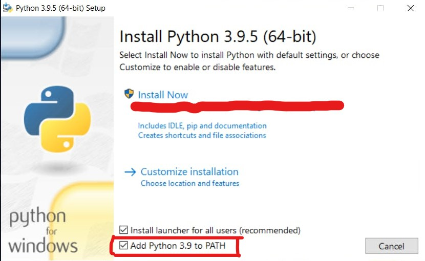
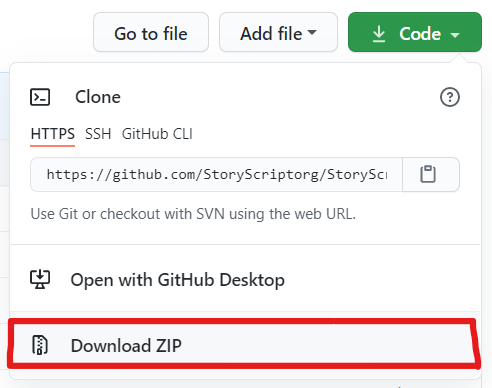

# Getting started

Hello and Welcome to this Tutorial series. Today we will be getting the StoryScript Interpreter correctly set up.

## Installing Python

First, **install Python.** Go to [https://python.org/downloads](https://python.org/downloads) then download Python 3.9.5. At the time of writing, This is the most recent version. You may try to download a newer version of Python, But to ensure that everything works, Download Python 3.9.5

After you've downloaded the Python setup, Open it. It will require an Administration privilage.  
Click allow, And then, Make sure to click "Add Python 3.9.5 to Path"



Then, click "Install now" and it will install all required components.

After The installation is complete, Some people might get a Button said something like "Cancel path limit", I'd recommend you to click it.

## Installing StoryScript

To install StoryScript, First, go to the [StoryScript repository](https://github.com/StoryScriptorg/StoryScript) and Download the Source and Extract the Zip file.



Or If you have git, You can clone the repository as well. Using this command:

```bash
git clone https://github.com/StoryScriptorg/StoryScript.git
```

Or If you don't have Git, But you have GitHub Desktop, You can clone the Repository there as well.


After you've gone to the URL tab and Fill the URL bar, Click **Clone.**

And then you got StoryScript installed!

## Testing StoryScript

To test StoryScript, Open **Command line** or **Powershell**.

Then go to the Place you've extracted/cloned the StoryScript file. Then go into the python directory.  
And type this command:

```bash
python shell.py
```

This will start the Shell up. So we could test StoryScript.

After the Shell have launched, Type this:

```python
print ("Hello, world!")
```

And press enter, And You should see a text said "Hello, world!".

A little bit of explanation, This will call a built-in method called "print" Which will print out the provided _argument_.

### What is an Argument?

Argument is a Data specified to the Function to make the Function works as Expected.

For example:

```python
welcome ("David", 32)
```

This will call a Function called "welcome" with the Arguments of "David" and 32.

